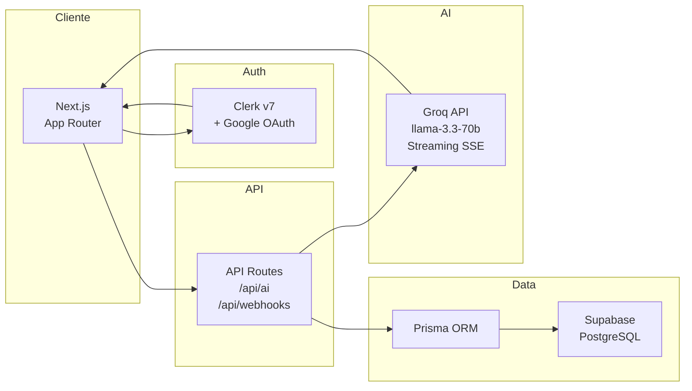

# PropMetrics

<div align="center">

**Plataforma SaaS de análisis de inversión inmobiliaria tokenizada**

[](https://prop-metrics.vercel.app)
[](https://nextjs.org)
[](https://typescriptlang.org)
[](https://prisma.io)
[](https://supabase.com)
[](https://clerk.com)

[🚀 Ver Demo en vivo](https://prop-metrics.vercel.app) · [📖 Documentación](./docs/architecture.md) · [🗺️ Roadmap](./docs/PLAN_DE_DESARROLLO.md)

</div>

---

## ¿Qué es PropMetrics?

PropMetrics centraliza el análisis de proyectos de inversión inmobiliaria tokenizada. Permite a los inversores visualizar su portafolio en tiempo real, explorar nuevos proyectos, simular rentabilidad y consultar un asistente de IA especializado en finanzas inmobiliarias.

---

## ✨ Funcionalidades

| Módulo | Descripción |
|--------|-------------|
| 📊 **Dashboard** | KPIs en tiempo real: TIR, dividendos acumulados, tokens activos, valor del portafolio |
| 🏗️ **Marketplace** | Proyectos tokenizados con filtros por tipo (Renta, Desarrollo, Socio Preferente) y rentabilidad |
| 📈 **Simulador** | Proyección interactiva de rentabilidad con sliders dinámicos |
| 🤖 **Asistente IA** | Chat financiero con Groq (llama-3.3-70b) con streaming en tiempo real |
| 🔐 **Autenticación** | Multi-tenant con Clerk: registro por email y Google OAuth |
| 🔔 **Notificaciones** | Sistema de alertas por dividendos y nuevos proyectos |

---

## 🛠️ Stack tecnológico

| Capa | Tecnología |
|------|-----------|
| Frontend | Next.js 16 (App Router), TypeScript, Tailwind CSS v4, shadcn/ui |
| Backend | Next.js Server Components, API Routes (Edge Runtime) |
| Base de datos | Supabase (PostgreSQL) + Prisma ORM v7 + PgBouncer |
| Autenticación | Clerk v7 (JWT, multi-tenant, webhooks via Svix) |
| Inteligencia Artificial | Groq API — llama-3.3-70b-versatile (streaming SSE) |
| Deploy | Vercel (CI/CD automático desde rama `main`) |

---

## 🗄️ Arquitectura



> Diagrama completo → [`docs/architecture.md`](./docs/architecture.md)

---

## 🚀 Demo

Accede a la aplicación en producción:

**[→ prop-metrics.vercel.app](https://prop-metrics.vercel.app)**

Para explorar sin crear cuenta, usa las credenciales de demo:
```
Email:    demo@propmetrics.app
Password: Demo1234!
```

---

## ⚙️ Instalación local

### Requisitos
- Node.js 18+
- Cuenta en [Supabase](https://supabase.com)
- Cuenta en [Clerk](https://clerk.com)
- API Key de [Groq](https://console.groq.com)

### Pasos

```bash
# 1. Clonar el repositorio
git clone https://github.com/cristian102711/prop-metrics.git
cd prop-metrics

# 2. Instalar dependencias (genera el cliente Prisma automáticamente)
npm install

# 3. Configurar variables de entorno
cp .env.example .env
# Editar .env con tus credenciales

# 4. Ejecutar migraciones y seed
npx prisma migrate dev
npx prisma db seed

# 5. Iniciar el servidor de desarrollo
npm run dev
```

Abre [http://localhost:3000](http://localhost:3000)

---

## 🔑 Variables de entorno

```env
# Base de datos (Supabase)
DATABASE_URL=           # Connection string con PgBouncer
DIRECT_URL=             # URL directa sin pooling

# Autenticación (Clerk)
NEXT_PUBLIC_CLERK_PUBLISHABLE_KEY=
CLERK_SECRET_KEY=
CLERK_WEBHOOK_SECRET=
NEXT_PUBLIC_CLERK_SIGN_IN_URL=/sign-in
NEXT_PUBLIC_CLERK_SIGN_UP_URL=/sign-up
NEXT_PUBLIC_CLERK_SIGN_IN_FALLBACK_REDIRECT_URL=/portfolio
NEXT_PUBLIC_CLERK_SIGN_UP_FALLBACK_REDIRECT_URL=/portfolio

# Inteligencia Artificial
GROQ_API_KEY=
```

---

## 📁 Estructura del proyecto

```
prop-metrics/
├── app/
│   ├── (auth)/             # /sign-in  /sign-up
│   ├── (dashboard)/        # /portfolio  /projects  /simulator  /assistant
│   └── api/
│       ├── ai/             # Streaming SSE con Groq
│       └── webhooks/clerk/ # Sincronización de usuarios
├── components/
│   ├── ui/                 # Componentes shadcn/ui
│   └── charts/             # Recharts: Portfolio, Dividendos, Distribución
├── lib/
│   ├── prisma.ts           # Cliente Prisma singleton
│   └── getAuthUser.ts      # Get-or-create del usuario autenticado
├── prisma/
│   ├── schema.prisma
│   └── seed.ts
└── docs/
    ├── architecture.md     # Diagramas y flujos del sistema
    └── PLAN_DE_DESARROLLO.md
```

---

## 🚧 En desarrollo

- **Notificaciones en tiempo real** — Integración con n8n para alertas automáticas de dividendos y nuevos proyectos
- **Perfil de usuario** — Historial de inversiones y descarga de estados de cuenta
- **Tests E2E** — Playwright para flujos críticos

---

## 👤 Autor

**Cristian Velásquez** — Full Stack Developer

[](https://www.linkedin.com/in/cristian-carlos-velasquez-cornejo/)
[](https://github.com/cristian102711)
[](https://portfolio-cristian-app.vercel.app)