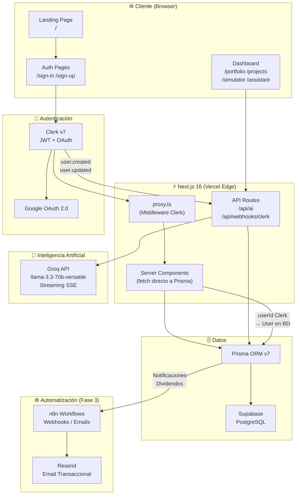

# PropMetrics — Arquitectura del Sistema

## Diagrama de flujo general



---

## Modelo de datos (Prisma Schema)

```
User
├── clerkId (FK → Clerk)
├── email
├── name
├── role (ADMIN | INVESTOR)
├── investments[]
└── notifications[]

Project
├── name, type, location
├── targetAmount, currentAmount
├── tir, status
├── investments[]
└── dividends[]

Investment
├── userId (FK → User)
├── projectId (FK → Project)
├── amount
└── tokens

Dividend
├── projectId (FK → Project)
├── amount
└── paidAt

Notification
├── userId (FK → User)
├── type (DIVIDEND | PROJECT | REPORT)
├── message
└── read
```

---

## Flujo de autenticación

```
1. Usuario visita /sign-in
2. Clerk autentica (email o Google OAuth)
3. Clerk emite JWT → almacenado en cookie HttpOnly
4. proxy.ts (middleware) valida JWT en cada request
5. Server Component llama getAuthUser() → obtiene clerkId
6. getAuthUser() busca User en BD o lo crea (get-or-create)
7. Todas las queries Prisma se filtran por userId
```

---

## Flujo del Asistente IA

```
1. Usuario escribe pregunta en /assistant
2. POST /api/ai con historial del chat + pregunta
3. API construye prompt con contexto del portfolio del usuario
4. Groq API responde con streaming SSE
5. ReadableStream enviado al cliente
6. Frontend renderiza el texto token por token (streaming)
```

---

## Variables de entorno requeridas

| Variable | Servicio | Obligatoria |
|---|---|---|
| `DATABASE_URL` | Supabase (PgBouncer) | ✅ |
| `DIRECT_URL` | Supabase (directo) | ✅ |
| `NEXT_PUBLIC_CLERK_PUBLISHABLE_KEY` | Clerk | ✅ |
| `CLERK_SECRET_KEY` | Clerk | ✅ |
| `CLERK_WEBHOOK_SECRET` | Clerk Webhooks | ✅ |
| `GROQ_API_KEY` | Groq | ✅ |
| `NEXT_PUBLIC_CLERK_SIGN_IN_URL` | Clerk | ✅ |
| `NEXT_PUBLIC_CLERK_SIGN_UP_URL` | Clerk | ✅ |
